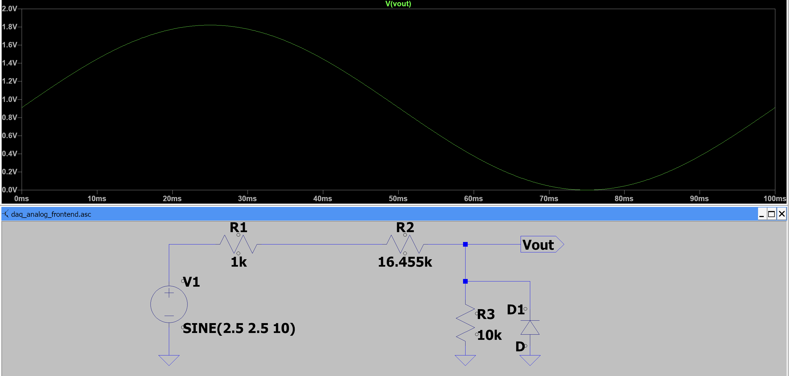
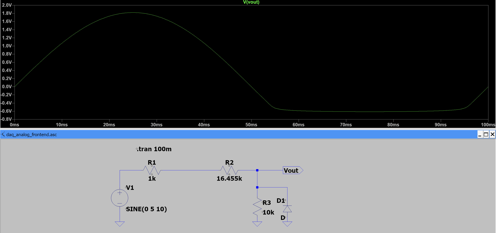
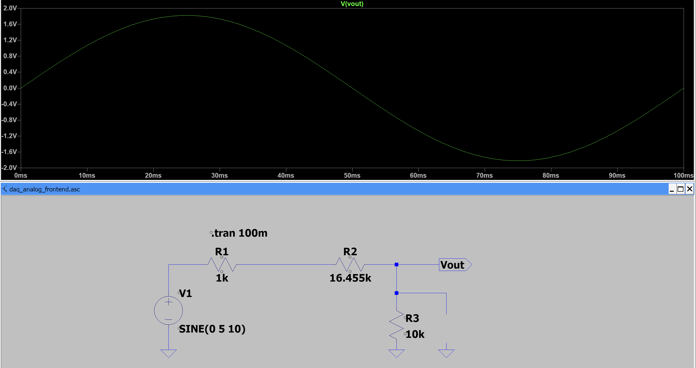
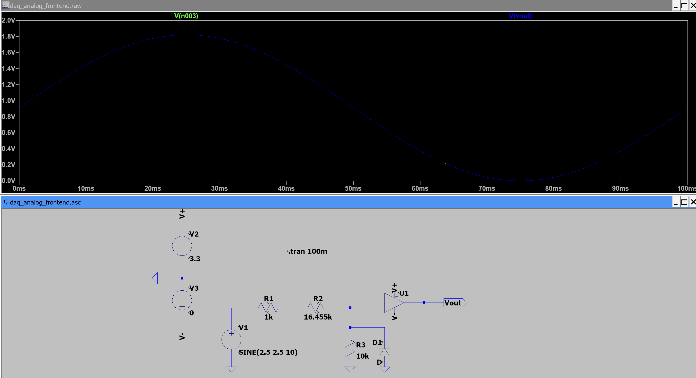
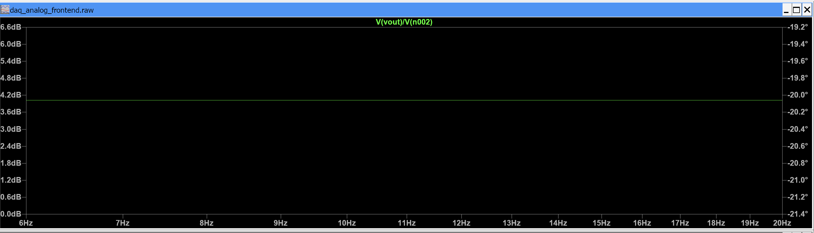
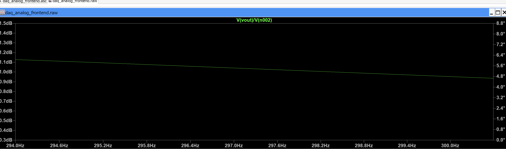
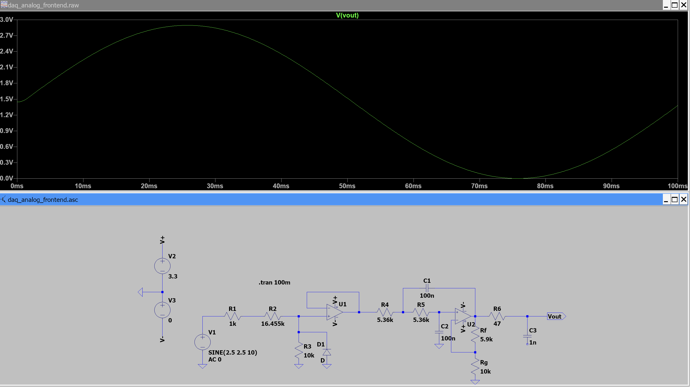
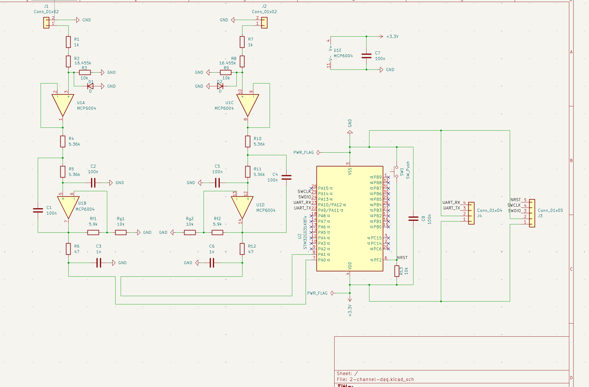
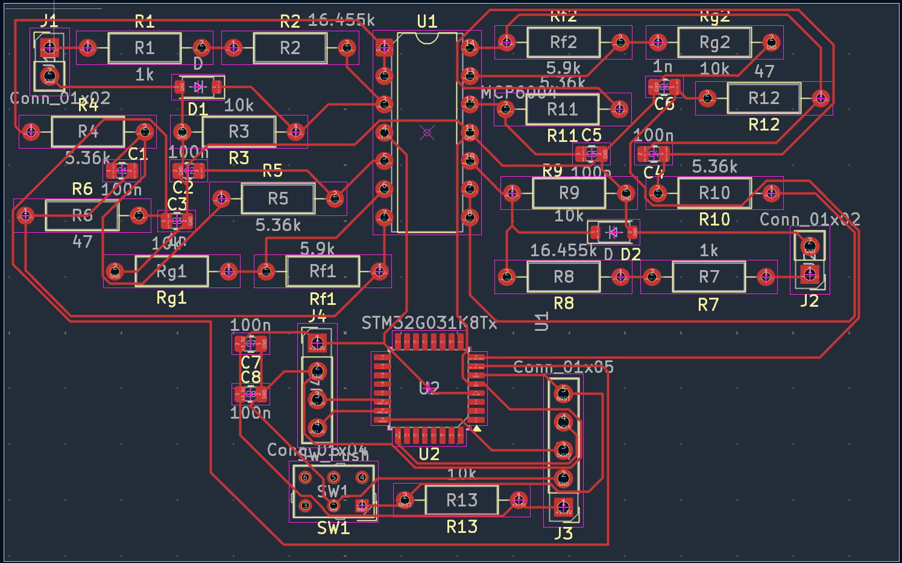
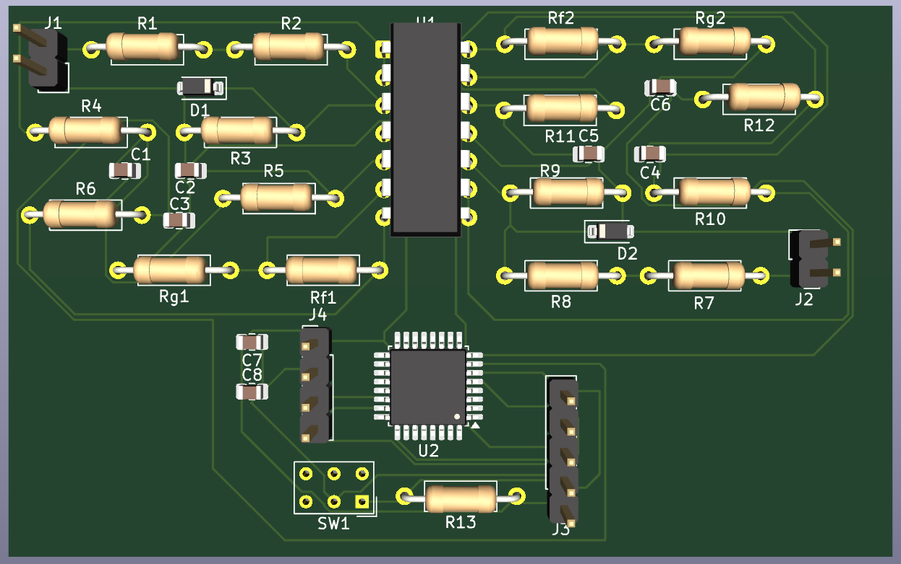

# 2-Channel-Mixed-Signal-Data-Acquisition-PCB# 2-Channel Mixed-Signal Data Acquisition PCB

## Overview

This project involves the design of a 2-channel mixed-signal data acquisition system intended to measure 0–5 V analog signals and convert them into digital data for microcontroller-based processing and analysis.

Each analog input passes through input protection, voltage scaling, buffering, and active low-pass filtering before being sampled by a 12-bit ADC on an STM32 microcontroller.

The system is being designed and simulated using LTspice and will be implemented as a 2-layer PCB using KiCad. Embedded C will be used for microcontroller data acquisition and MATLAB will be used for data analysis.

## Objectives

* Design a 2-channel analog data acquisition system
* Accept 0–5 V analog input signals
* Scale the input signals to an ADC-compatible voltage range
* Implement input protection against abnormal voltage excursions
* Buffer the analog signals to minimize loading between circuit stages
* Implement 2nd-order active low-pass filtering
* Sample the conditioned signals using a 12-bit ADC
* Transfer acquired data through UART
* Verify circuit behavior through simulation
* Design and verify a 2-layer PCB
* Analyze acquired data using MATLAB

## Tools

* LTspice
* KiCad
* C
* MATLAB
* Git / GitHub

## Circuit Design


## Design Summary

| Parameter                 |                Value |
| ------------------------- | -------------------: |
| Number of channels        |                    2 |
| Input signal              |                0–5 V |
| ADC voltage range         |              0–3.3 V |
| ADC resolution            |               12-bit |
| Sampling rate             |       4 kS/s/channel |
| Useful bandwidth          |             0–100 Hz |
| Low-pass filter           | 2nd-order Sallen-Key |
| Filter cutoff             |              ~297 Hz |
| Nominal system gain       |            ~0.60 V/V |
| Maximum nominal ADC input |               ~3.0 V |
| Microcontroller           |        STM32G031K8T6 |
| Analog op-amp             |              MCP6004 |
| PCB layers                |                    2 |
| PCB dimensions            |          ~80 × 50 mm |
| UART baud rate            |          460800 baud |

## LTspice Simulation

### Verification Procedure

The analog front end is being verified using a node-by-node transient analysis.

Each verification step checks a specific electrical condition before proceeding to the next stage.

### 1. Voltage divider

**Purpose:**
Verify that the input protection resistor and voltage divider produce the expected scaled voltage for a 0–5 V input signal.

**Circuit Configuration:**

| Component                 |   Value |
| ------------------------- | ------: |
| Input protection resistor |    1 kΩ |
| R_TOP                     | 16.5 kΩ |
| R_BOTTOM                  |   10 kΩ |

**Test Signal:**

```text
SINE(2.5 2.5 10)
```

The input signal has a 2.5 V DC offset, 2.5 V amplitude, and 10 Hz frequency, resulting in a 0–5 V input waveform.

**Transient Analysis:**

```text
.tran 100m
```

The 100 ms simulation window corresponds to one complete cycle of the 10 Hz input signal.

**Procedure:**

1. Apply the 0–5 V test signal to the input.
2. Run a transient analysis for 100 ms in LTspice.
3. Probe the input node.
4. Confirm that the input signal ranges from 0 V to 5 V.
5. Probe the output of the voltage divider.
6. Confirm that the scaled signal ranges from approximately 0 V to 1.82 V.

**Expected Result:**

| Parameter             | Expected |
| --------------------- | -------: |
| Input minimum         |      0 V |
| Input maximum         |      5 V |
| Scaled output minimum |     ~0 V |
| Scaled output maximum |  ~1.82 V |

**Measured Result:**
`Vin = 0–5.00 V`
`Vscaled = 0–1.82 V`

**Result:** Pass



### 2. Diode Voltage Protection Verification

**Purpose:**
Verify that the protection diode limits abnormal negative voltage excursions at the scaled node.

A bipolar test signal will be applied to intentionally drive the input below the normal 0–5 V operating range.

**Test Signal:**

```text
SINE(0 5 10)
```

This produces a −5 V to +5 V input waveform.

**Procedure:**

1. Apply the bipolar test signal to the input.
2. Run a transient analysis for 100 ms in LTspice.
3. Probe the scaled node.
4. Observe the negative voltage excursion without the protection diode.
5. Enable the protection diode.
6. Repeat the simulation.
7. Compare the negative voltage excursion with and without the diode.

**Expected Result:**

The protection diode should conduct during the negative voltage excursion and limit the negative voltage at the protected node.

**Measured Result:**
Without the diode, the scaled node follows the negative input excursion. With the diode connected, the negative voltage is clamped and the scaled node no longer follows the negative excursion below the diode's forward-voltage region.

**Result:** Pass





### 3. Buffer Verification

**Purpose:**
Verify that the voltage buffer reproduces the scaled input signal without significantly changing its voltage level. The buffer also isolates the voltage divider from the following filter stage by providing high input impedance and low output impedance.

**Buffer Configuration:**

| Parameter      |                                        Value |
| -------------- | -------------------------------------------: |
| Op-Amp         |                              UniversalOpamp2 |
| Configuration  |                             Voltage follower |
| Supply voltage |                                  3.3 V / 0 V |
| Buffer input   |                       Voltage divider output |
| Buffer output  |                                 Filter input |
| Feedback       | Output directly connected to inverting input |

**Procedure:**

1. Apply the 0–5 V input signal using `SINE(2.5 2.5 10)`.
2. Run the transient simulation for 100 ms.
3. Measure the voltage at the output of the voltage divider.
4. Measure the voltage at the output of the buffer.
5. Compare the two waveforms over the full input cycle.

**Expected Result:**

The buffer output should closely follow the voltage-divider output with approximately unity voltage gain.

$$
A_v = \frac{V_{OUT}}{V_{IN}} \approx 1
$$

For the 0–5 V input signal, the voltage divider produces approximately 0–1.82 V. Therefore, the buffer output should also be approximately 0–1.82 V.

| Measurement           | Expected Result |
| --------------------- | --------------: |
| Buffer input minimum  |            ~0 V |
| Buffer input maximum  |         ~1.82 V |
| Buffer output minimum |            ~0 V |
| Buffer output maximum |         ~1.82 V |
| Voltage gain          |          ~1 V/V |

**Measured Result:**

The buffer output closely follows the voltage-divider output. The buffer input and output waveforms overlap over the 0–1.82 V range, confirming that the voltage follower provides approximately unity gain without significantly altering the signal amplitude.

**Result:** Pass



### 4. Sallen-Key Filter Response Verification

**Purpose:**
Verify that the Sallen-Key stage provides the intended second-order low-pass response, including the expected low-frequency gain, cutoff frequency, and roll-off behavior.

**Filter Configuration:**

| Parameter     |       Value |
| ------------- | ----------: |
| R1            |     5.36 kΩ |
| R2            |     5.36 kΩ |
| C1            |      100 nF |
| C2            |      100 nF |
| Rf            |     5.90 kΩ |
| Rg            |       10 kΩ |
| Op-Amp Supply | 3.3 V / GND |

**Theoretical Low-Pass Cutoff:**

For equal resistor and capacitor values:

$$
f_c = \frac{1}{2\pi RC}
$$

$$
f_c = \frac{1}{2\pi(5.36\,k\Omega)(100\,nF)}
\approx 297\,Hz
$$

The Sallen-Key gain is:

$$
K = 1 + \frac{R_f}{R_g}
$$

$$
K = 1 + \frac{5.90\,k\Omega}{10\,k\Omega}
\approx 1.59
$$

The corresponding low-frequency magnitude is:

$$
20\log_{10}(1.59) \approx 4.03\,dB
$$

For a second-order low-pass filter, the cutoff frequency is approximately **3 dB below the passband magnitude**. Therefore, with a passband magnitude of approximately +4 dB, the expected magnitude at the cutoff is approximately +1 dB.

**Procedure:**

1. Set the LTspice input source to:

   * DC value: `2.5 V`
   * AC amplitude: `1 V`
   * AC phase: `0°`
2. Run an AC sweep using:
   `.ac dec 100 1 100k`
3. Plot the filter transfer function:
   `V(FILTER_OUT)/V(BUF_OUT)`
4. Measure the magnitude in the low-frequency passband.
5. Measure the magnitude near the theoretical cutoff frequency of 297 Hz.
6. Verify the expected attenuation beyond the cutoff region.

**Expected Result:**

| Measurement             |       Expected |
| ----------------------- | -------------: |
| Low-frequency gain      |      ~1.59 V/V |
| Low-frequency magnitude |      ~+4.03 dB |
| Cutoff frequency        |        ~297 Hz |
| Magnitude at cutoff     |      ~+1.03 dB |
| High-frequency roll-off | ~−40 dB/decade |

**Measured Result:**

* At **10 Hz:** approximately **+4 dB**
* At **297 Hz:** approximately **+1 dB**
* The measured response is consistent with the expected second-order low-pass behavior.

**Result:** Pass

The measured passband gain and attenuation at 297 Hz closely match the theoretical response. The filter therefore provides the intended low-pass behavior with a cutoff frequency of approximately 297 Hz.




### 5. ADC Input Range Verification

**Purpose:**
Verify that the conditioned analog signal remains within the STM32 ADC input range and that the complete analog front end provides the intended voltage scaling.

**ADC Configuration:**

| Parameter                    |       Value |
| ---------------------------- | ----------: |
| ADC voltage range            |     0–3.3 V |
| ADC resolution               |      12-bit |
| Input signal                 |       0–5 V |
| ADC input filter             | 47 Ω + 1 nF |
| Expected maximum ADC voltage |      ~3.0 V |

**Procedure:**

1. Connect the Sallen-Key filter output to the ADC input through the 47 Ω series resistor.
2. Add a 1 nF capacitor from the ADC input node to GND.
3. Apply a 0–5 V sinusoidal input using:
   `SINE(2.5 2.5 10)`
4. Run a transient simulation using:
   `.tran 100m`
5. Plot the ADC input node voltage, `V(ADC_IN)`.
6. Verify that the ADC input remains within the 0–3.3 V operating range.

**Expected Result:**

For a 5 V maximum input, the nominal analog gain of approximately 0.60 V/V gives:

$$
V_{ADC,max} \approx 5V \times 0.60
$$

$$
V_{ADC,max} \approx 3.0V
$$

The ADC input should therefore remain below the 3.3 V supply while utilizing most of the available ADC range.

**Measured Result:**

The simulated ADC input waveform remained sinusoidal and reached approximately **2.9 V maximum** for a 5 V maximum input.

| Measurement          | Result |
| -------------------- | -----: |
| Input minimum        |   ~0 V |
| Input maximum        |    5 V |
| ADC minimum          |   ~0 V |
| ADC maximum          | ~2.9 V |
| ADC supply/reference |  3.3 V |

The maximum ADC voltage is approximately 0.4 V below the 3.3 V supply, providing headroom while maintaining a large usable portion of the ADC input range.

**Result:** Pass

The simulated ADC input remains within the 0–3.3 V range and is suitable for connection to the STM32 ADC.




### Results

| Verification                |                Theoretical | Measured | Error | Result  |
| --------------------------- | -------------------------: | -------: | ----: | ------- |
| Voltage scaling             |                   0–1.82 V | 0–1.82 V |     — | Pass    |
| Negative voltage protection | Negative excursion clamped |  Pending |     — | Pending |
| Buffer                      |                    Pending |  Pending |     — | Pending |
| Filter cutoff               |                    ~297 Hz |  Pending |     — | Pending |
| Complete analog chain       |                    Pending |  Pending |     — | Pending |
| PCB DRC errors              |                          0 |  Pending |     — | Pending |

## PCB Design

*PCB design will be completed after the analog front-end simulation and verification.*

### Components

*To be completed.*

### Connector Pinout

*To be completed.*

### Circuit Parameters

| Parameter        |                Value |
| ---------------- | -------------------: |
| Supply Voltage   |               +3.3 V |
| Input Range      |                0–5 V |
| ADC Range        |              0–3.3 V |
| Sampling Rate    |       4 kS/s/channel |
| Filter           | 2nd-order Sallen-Key |
| Cutoff Frequency |              ~297 Hz |

### KiCAD schematic



### PCB Layout



### 3D View



### Fabrication Outputs

Gerber and drill files will be generated using KiCad for PCB manufacturing.

The fabrication outputs will include:

* Front and back copper
* Front and back solder mask
* Silkscreen
* Board outline
* Drill files

The generated files will be available in `KiCad/Gerbers/`.

### PCB Design Verification

The PCB layout will be checked using KiCad's Design Rules Checker (DRC).

**Target:**

* DRC errors: 0
* Unconnected items: 0
* Board outline: ~80 × 50 mm

## Firmware

*To be completed.*

The STM32 firmware will be responsible for:

* ADC configuration
* ADC sampling
* DMA-based data acquisition
* UART data transmission

## MATLAB Data Analysis

*To be completed.*

MATLAB will be used to process and analyze the sampled ADC data.

## Files

* `Documentation/` — design images and verification results
* `KiCad/` — schematic and PCB design files
* `LTspice/` — circuit simulations
* `Firmware/` — STM32 firmware
* `MATLAB/` — data analysis scripts
* `BOM/` — bill of materials
* `Gerbers/` — manufacturing outputs
